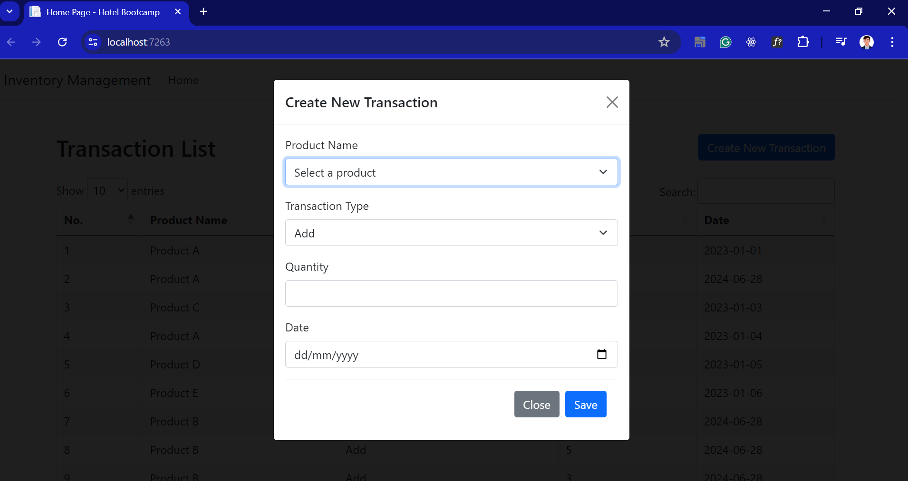
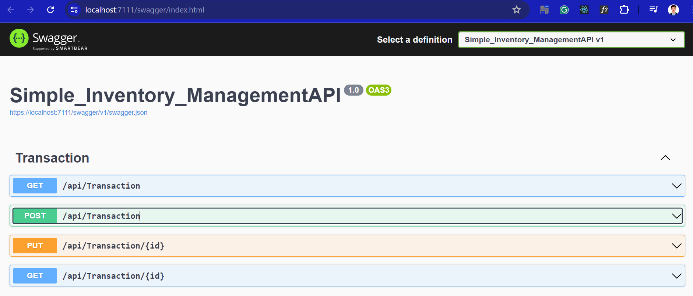
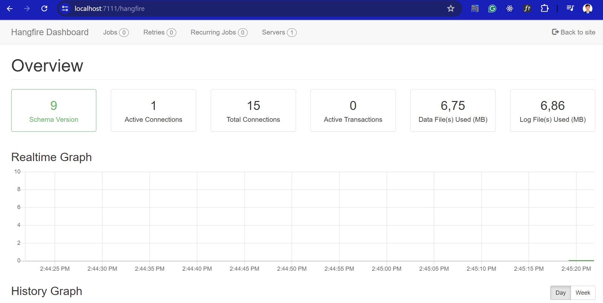

# Mini_Project_Inventory

Mini Project Inventory

## Deskripsi Proyek
Proyek Mini ini adalah tentang pengelolaan transaksi produk. Proyek ini terdiri dari dua bagian utama:

1. **Console App**: Aplikasi konsol yang digunakan untuk mengelola data produk.
2. **Web Application**: Aplikasi web yang mengakses dan mengelola data produk melalui API yang telah dibuat.

Proyek ini dirancang untuk menyediakan antarmuka yang sederhana dan intuitif untuk mengelola transaksi produk, termasuk penambahan dan pengurangan stok berdasarkan transaksi yang dilakukan.

## Fitur
- Tambah Produk (Console App)
- Update Produk (Console App)
- Hapus Produk (Console App)
- Tambah Transaksi (Penambahan/Pengurangan Stok)
- Lihat Riwayat Transaksi
- API untuk akses data produk dan transaksi

# Contoh Screenshoot

